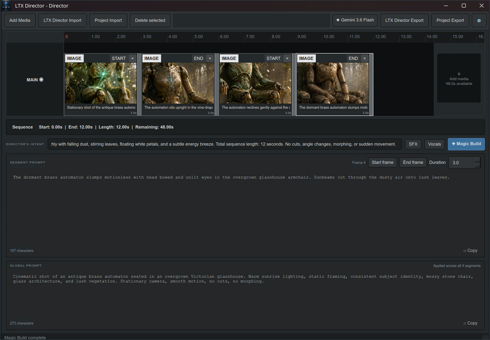
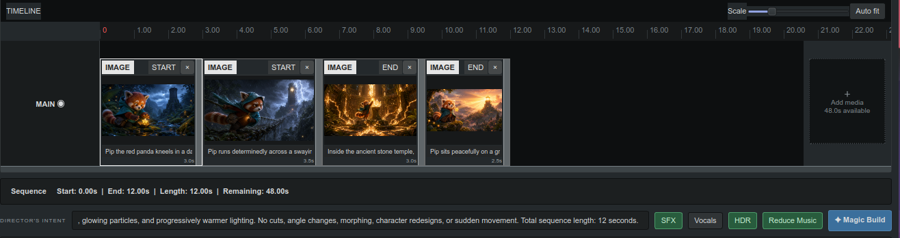
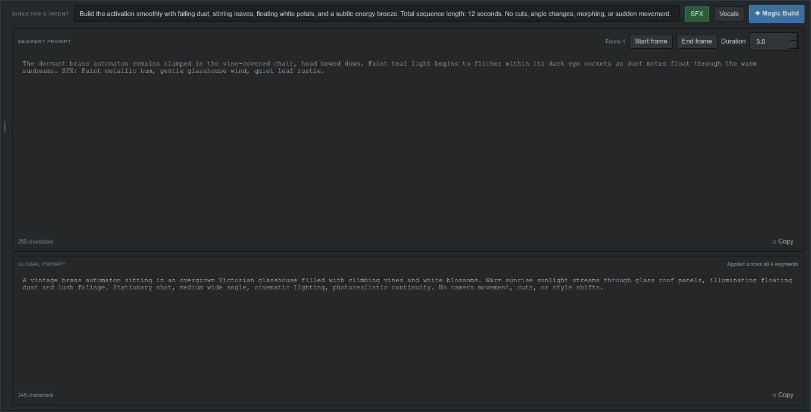
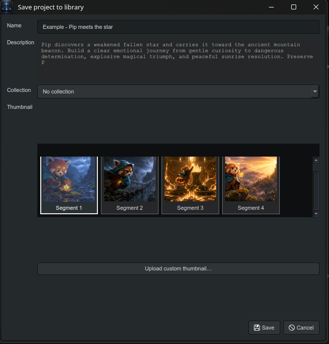

# LTX Director - Director

**LTX Director - Director** is a native companion app for the [LTXDirector custom node for ComfyUI](https://github.com/WhatDreamsCost/WhatDreamsCost-ComfyUI). Its primary purpose is to prepare image and WebM timelines outside ComfyUI, use Gemini or OpenAI to build LTX Video 2.3 prompts, and export the finished sequence directly into LTXDirector.



## What it does

LTX Director - Director turns a folder of reference frames into a structured LTX Video 2.3 sequence:

1. Start a project, add images or WebM clips, and arrange them directly on the visual timeline.
2. Mark each segment as a start frame or end frame, then drag its edge to set the duration.
3. Describe the overall scene in the multiline **Director's Intent**, optionally set an exact total sequence length, and enable SFX or Spoken Dialog with speaker context when needed.
4. Run **Magic Build** to refine timing and generate a focused prompt for every segment.
5. Fine-tune a selected segment with **Refine Timing** or **Refine Prompt**, then export the sequence as JSON for the ComfyUI LTXDirector node.



*Duration-scaled segments make the full sequence readable at a glance. Frames can be reordered, resized, replaced, assigned a role, or deleted without leaving the timeline.*



*Magic Build creates the selected segment's motion prompt and a global prompt that keeps subject identity, setting, lighting, camera, and style consistent across the sequence.*

## Project library

Save working projects directly into the searchable project library and organize related work into collections. Resize the panel from its dotted right-edge grip, then choose Small, Medium, or Large icons from the control at the top. Tiles wrap left-to-right as room becomes available, while project cards can use the first segment automatically, any segment's starting frame, or a custom uploaded thumbnail.



*Edit Project Details provides a visual thumbnail picker while preserving the automatic first-segment fallback for projects that do not define one.*

## Export-first workflow

The app is designed around moving a prepared sequence into [LTXDirector for ComfyUI](https://github.com/WhatDreamsCost/WhatDreamsCost-ComfyUI), where generation and final timeline work take place.

- **LTX Director Export** writes an LTXDirector-compatible JSON file containing the supported timeline segments, timing, output width and height, start/end-frame roles, per-segment prompts, global prompt, and referenced media. WebM segments remain complete videos in the export even though Magic Build sends only a single optimized preview frame to the vision model.
- **Open** brings supported LTXDirector JSON data back into the desktop timeline for further prompt and timing work.
- **Project Export** saves the complete editable LTX Director - Director project as a `.LTXD` file, including embedded media and app-specific state. Use this format when you intend to reopen the project in this app.
- **Import** restores a `.LTXD` project without requiring the original media files to remain in their previous locations. Legacy project JSON files remain readable.

In short: use **Project Export** for lossless editing and safekeeping; use **LTX Director Export** when the sequence is ready to move into ComfyUI.

## Highlights

- Native PySide6 interface for Linux, Windows, and macOS
- Web-app-matched dark editor layout with compact toolbar and stacked prompt panels
- DPI-aware control spacing with modern sliders, dropdowns, number steppers, rounded scrollbars, and consistent button states
- Numbered timeline ruler with duration-proportional segment widths
- Adjustable timeline scale, one-click auto fit, and vertically resizable previews
- Drag-and-drop media import with a highlighted timeline drop target
- Animated in-timeline loading indicator while segment tiles are prepared
- Drag-to-reorder horizontal timeline and smoothly animated AI timing recommendations
- Selected-segment **Refine Timing** and **Refine Prompt** passes with adjacent-frame continuity context
- One-second minimum segment duration in 0.5-second increments
- Right-click replace, one-click segment export, role assignment, and deletion
- Direct KDE `kdialog`, GNOME `zenity`, macOS, and Windows native media-picker integration
- Branded application icon and automatic per-user Linux desktop-menu installation
- WebM support with a preview captured at the start of the final second
- Only one optimized frame per WebM is sent to vision AI
- Gemini and OpenAI support with local key storage, configurable API timeout, retry count, and cooldown countdown between transient connection retries
- Blocking in-app Magic Build overlay with custom animation
- Independent SFX, Spoken Dialog, HDR, and Reduce Music controls
- Dedicated total-length, speaker-language, and speaker-accent controls dynamically composed into the authoritative Magic Build request
- LTX Director-compatible JSON import/export
- Complete portable project import/export, including embedded media
- Searchable, resizable local project library with selectable thumbnail sizes, a responsive wrapping grid, collection folders, title sorting, and stable custom drag ordering
- Automatic Custom-sort activation when a project tile is dragged
- Multiple live in-memory project workspaces with yellow unsaved-change indicators
- Persistent window, dialog, and project-panel placement and width, with automatic reopening of the last active library project
- Persistent 75–200% UI text scaling for easier reading on high-DPI displays
- No server, database, account, or telemetry

## Quick start from source

```bash
python3 -m venv .venv
source .venv/bin/activate
python -m pip install -r requirements.txt
python -m ltx_prompt_director
```

Windows activation:

```powershell
.venv\Scripts\activate
```

## Install from a wheel

### One-line Linux install or update

This automatically finds the wheel attached to the latest GitHub release, installs or upgrades it, and creates the Linux desktop shortcut:

```bash
python3 -m pip install --upgrade "$(wget -qO- https://api.github.com/repos/etoven/ltx-director-director/releases/latest | sed -n 's/.*"browser_download_url": "\(.*\.whl\)".*/\1/p' | head -n 1)" && ltx-director-director-install-desktop
```

Or download the `.whl` file from the latest GitHub release, then install it with:

```bash
python3 -m pip install ./ltx_prompt_director-1.12.0-py3-none-any.whl
```

You can also install a locally built wheel from the repository:

```bash
python3 -m pip install ./dist/ltx_prompt_director-*.whl
```

Launch the installed application with:

```bash
ltx-director-director
```

Using a virtual environment is recommended if you do not want to install the package into your user Python environment.

## Linux desktop shortcut

After installing the wheel or package, add LTX Director - Director to your desktop environment's application menu:

```bash
ltx-director-director-install-desktop
```

The shortcut is installed for the current user. You may need to reopen the application launcher before it appears. To remove it later:

```bash
ltx-director-director-uninstall-desktop
```

The app also attempts to install the per-user shortcut automatically on its first Linux launch.

See [install.md](install.md) for platform setup and [usage.md](usage.md) for the complete workflow.

## Privacy

Media processing happens locally. Magic Build sends compressed 384-pixel reference frames and prompt instructions directly to the selected AI provider. Full WebM files are never sent to the AI. API keys are never included in project or LTX exports.

## License

MIT
