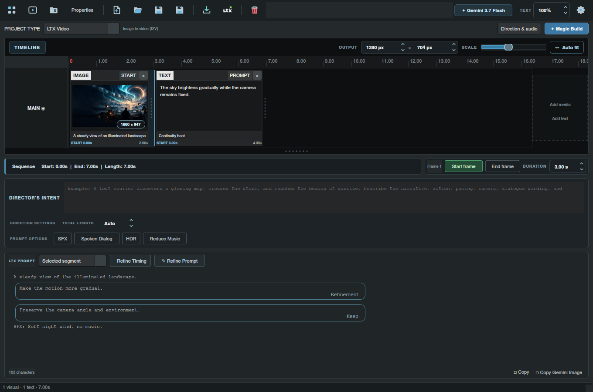

# LTX Director - Director

**Turn a visual timeline into a production-ready video prompt.** Arrange images, video clips, and text beats; set their timing; then build prompts for **MiniMax H3** or **LTX Video 2.3** without losing track of what happens when.

This is the **Aurora 1.13.0a18 experimental build**. MiniMax and LTX share one workspace, so you can plan a sequence, adjust its beats, and refine the wording in the same window. The app prepares prompts and exports; video rendering happens in your video workflow.


## Choose the way you want to direct

| Workflow | What Director builds | What you edit |
| --- | --- | --- |
| **MiniMax H3 · Frames** | One continuous production brief with timed actions grounded in the timeline's conditioning frames | The entire brief in the shared editor |
| **MiniMax H3 · References** | A production brief that identifies timed video or frame sources and untimed image references | The entire brief, with two optional reference image slots |
| **LTX Video 2.3** | A prompt for each segment plus a global continuity prompt | The selected segment or global prompt in the same editor |

Use **Gemini or OpenAI** for prompt generation and refinement. Generation is manual: changing a workflow, moving a frame, or adding a reference does not call the provider.

## MiniMax: direct the whole sequence

Choose **Frames** when your images are timed conditioning checkpoints. Choose **References** when you are working with first and last frames, source video, mixed media, or untimed identity and style references. Director detects the available input pattern and writes a structured brief with reference roles, continuity, scene direction, timed action, sound, and avoid instructions where appropriate.

The production prompt is one editable document. Its **timed action cues stay linked to the timeline segments**: retiming a segment updates the cue timecodes, and editing cue text updates its linked segment. Click a timeline segment to jump to its action. Paste a timed brief to resize existing segments and add new beats; incomplete matches turn gray until corrected. Timecode cells are protected from accidental deletion. Two optional image drop targets let you guide identity, body details, or another selected attribute without pretending those references occur at a particular second.

Refine the full prompt after a timeline change, or refine your own edits and inline instructions. Type `/` and press Tab for **Refinement**, **Global refinement**, **Keep**, **Avoid**, or **Focus** notes. The complete instruction stays editable inside the outlined note; a completed global refinement is consumed after a successful pass. The editor also offers inline spelling suggestions from your installed system dictionary.


## LTX: build every beat

Lay out start and end frames, text beats, WebM clips, or MP4 clips on the duration-scaled timeline. **Magic Build** uses the ordered media and Director's Intent to draft segment motion prompts and a global continuity prompt. Add SFX or spoken-dialog direction, adjust a single segment's timing or wording, and keep the rest of the sequence intact. Refinement can lengthen a beat when the action needs more room; its tile grows with it.

The shared editor switches to the segment you select or to the global prompt. When the sequence is ready, **LTX Director Export** produces JSON for the [LTXDirector ComfyUI node](https://github.com/WhatDreamsCost/WhatDreamsCost-ComfyUI), with timing, media references, prompt text, and frame roles.




## Keep the project moving

Save a project to the library, switch between open workspaces, and return to its timeline and independent MiniMax drafts later. The dockable **Project Properties** panel keeps status, tags, and tasks beside the work. **Project Export** creates a portable `.LTXD` archive with original-resolution media; low-resolution timeline thumbnails live in the operating system cache to keep the editor responsive. Use the toolbar save action or close the app to write pending library changes.


## Make the workspace yours

Keep **Director’s Intent, total length, and prompt options** beside the editor in every mode. In **Settings → Workspaces**, edit the stock generation templates or create your own definition with the prompt layout, reference types, and audio support your project needs. Import and export definitions to reuse the same setup; restore the stock templates without losing custom workspaces.


**Export without the file-dialog shuffle.** Images, videos, portable projects, and Director JSON go to one project download folder with automatic names. The download button lights up when a file is ready. Open its recent-export tray to find the result or drag it straight into another application.


## Try the experimental wheel

```bash
python3 -m pip install --upgrade 'https://raw.githubusercontent.com/etoven/ltx-director-director/experimental/unified-project-workflows/dist/ltx_prompt_director-1.13.0a18-py3-none-any.whl'
ltx-director-director
```

For a Linux application-menu shortcut, run `ltx-director-director-install-desktop`. The stable `main` branch remains on 1.12.57; see [installation details](install.md) if you prefer that release or want to run from source.

## Learn more

- [Workspace definitions, timed paste, and export history](docs/workspace-definitions-and-exports.md)
- [Unified workflow behavior and prompt controls](docs/unified-workflows.md)
- [MiniMax References and detected workflows](docs/minimax-references.md)
- [Project performance, storage, and properties](docs/performance-and-properties.md)
- [Aurora splash and inline directive details](docs/aurora-splash.md)

**Local-first workspace.** Media preparation, previews, and project storage run on your machine. Prompt generation and refinement send the selected context to your configured AI provider; the app does not render video or require an app account.

MIT licensed.
