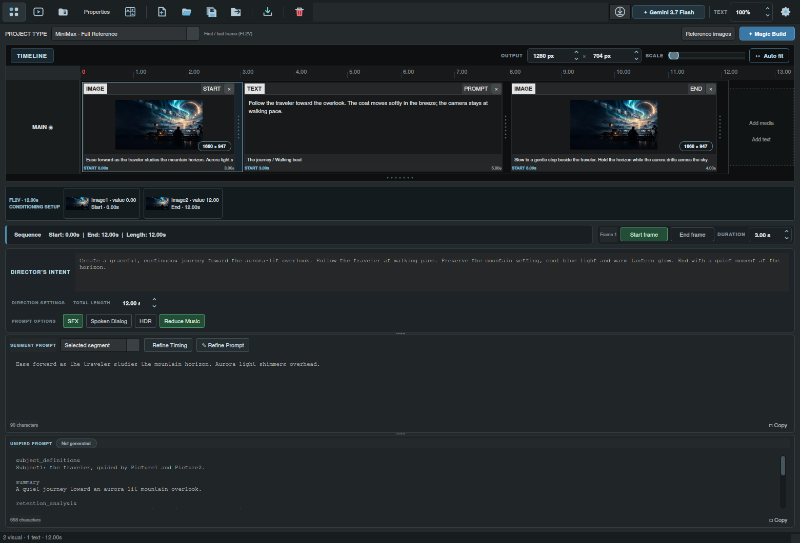
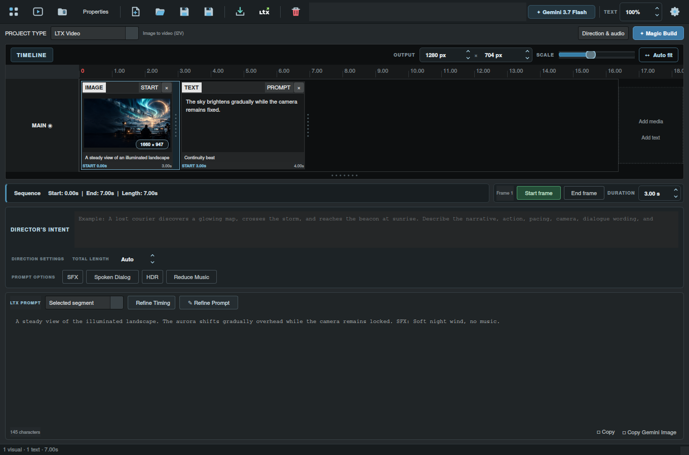
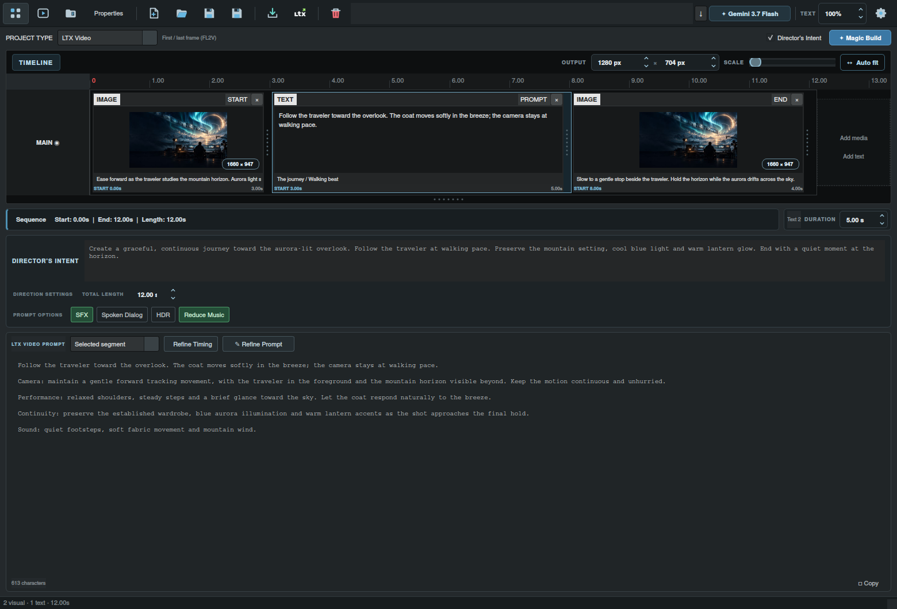
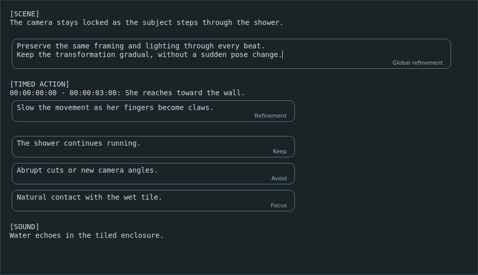
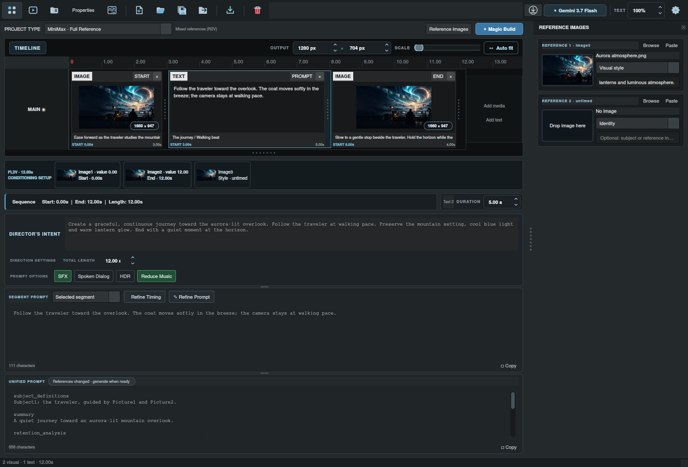
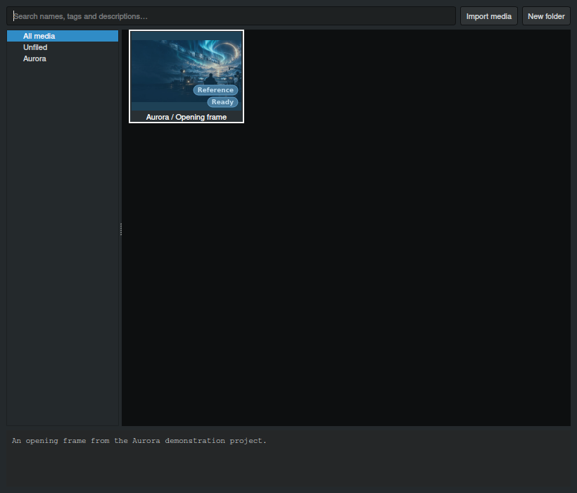
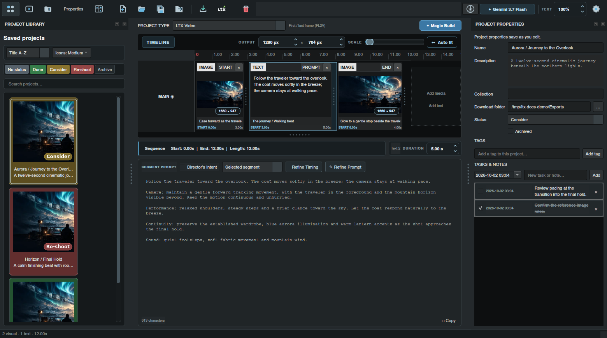
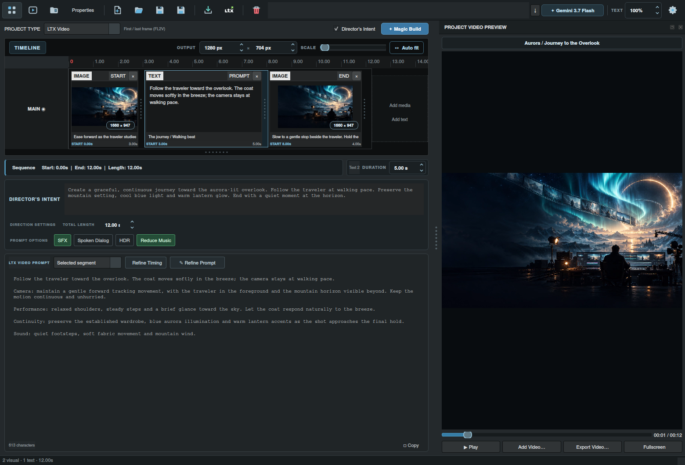
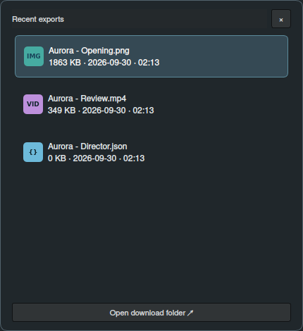

# LTX Director — Director

## Shape the moment. Direct the sequence.

**Your images, your story, your timing—brought together in one creative workspace.**

Build a visual plan for AI video, turn it into a detailed production prompt, and refine every beat while the timeline stays in view. LTX Director — Director gives you a hands-on way to direct **MiniMax H3** and **LTX Video 2.3**, with **Gemini or OpenAI** helping you develop the words behind the motion.



*Current release: Aurora 1.13.0a20 on `experimental`. Screenshots show the current native app with an authored demonstration project.*

## See the story before you generate

Put images, MP4 and WebM clips, and text beats on a timeline that shows how long each moment lasts. Drag to reorder. Pull a segment’s edge to change its duration. Zoom in to shape a transition or fit the whole sequence into view. Start times, frame roles and resolution badges keep the important details close at hand.

Replace a frame without rebuilding the beat. Copy an original image to the clipboard, paste a new image into its place, or turn a text idea into an image segment when your next reference is ready. The workspace grows with the sequence, without a fixed segment-count or total-length cap.



**[Explore the timeline and media tools →](docs/media-and-timeline.md)**

## Direct a complete film—or one precise beat

| Your creative approach | Your workspace | Your result |
| --- | --- | --- |
| Combine opening and closing frames, source video and visual references | **MiniMax** | A brief shaped around the roles of your supplied assets |
| Develop the movement of each timeline segment | **LTX Video** | Individual segment prompts and a shared global prompt, ready for Director JSON export |
| Bring your own prompting style | **Generic workspace** | A unified or segmented editor with your own generation and refinement instructions |

MiniMax action cues and timeline segments stay connected. Select a beat to focus its action. Change its timing and the cue boundaries follow. Paste a timed production brief to reshape the timeline around the new plan.

In LTX, **Magic Build** develops the whole sequence; **Refine Prompt** and **Refine Timing** let you concentrate on the selected beat. You can switch between workflows while keeping their stored drafts with the project.



**[Choose your workflow →](docs/unified-workflows.md)**

## Give the AI a direction worth following

Describe the performance, camera movement, continuity and mood in **Director’s Intent**. Set a target duration, add sound-effect direction or spoken-dialog guidance, and keep these choices as you move between modes. Collapse the panel whenever you want more writing space.

Keep your editing requests beside the passage they affect. Inline **Refinement, Global refinement, Keep, Avoid and Focus** notes make your intentions visible and editable inside the prompt. Refine the draft, review the result, and copy the text when it is ready.



**[Explore refinement, sound and dialogue →](docs/refinement-and-audio.md)**

## Keep identity, atmosphere and composition in view

Two untimed reference-image slots in the MiniMax workspace let you guide **Identity, Wardrobe, Setting, Visual style, Object / prop or Composition**. Add a picture by dropping it, browsing or pasting; explain the attributes you want in its notes. Timeline media sets the chronology. These image slots supply visual guidance.



**[Make the most of reference images →](docs/minimax-references.md)**

## Keep your media ready for the next project

Open the dockable **Media Catalog** to browse images and videos as large preview tiles. Organize your collection into folders, add searchable tags and short descriptions, and select several assets at once. Drag media onto the timeline, between catalog folders, or into your file manager.



## Build a library of work you can return to

Keep projects in a searchable visual gallery. Organize them into collections, sort by name or drag them into your preferred order, and use colored status and tag labels to see where each project stands. Add dated tasks and notes in the **Project Properties** dock. Pick a cover that makes each project easy to recognize.

Save to the local project library or export a portable **.LTXD** archive with original-resolution media, prompts and project context. Keep several projects open, switch between them, and return to each working draft.



**[Explore projects and organization →](docs/performance-and-properties.md)**

## Review the render. Reuse the moment.

Bring your rendered video back into the project. Play it in a dockable preview, click the playback bar to seek, or open fullscreen for a closer look. Export a frame or copy it to the clipboard to use in your next pass. Attach the ComfyUI workflow JSON alongside the project so the creative plan and rendering setup travel together.



**[Explore video review and project files →](docs/video-review-and-files.md)**

## Move from planning to production

Copy a MiniMax brief straight from the editor. Export LTX Director JSON for your ComfyUI workflow. Save original media, captured video frames and portable projects into a consistent download folder. The export button signals when a file is ready; **Recent exports** lets you open it, reveal its folder or drag it into another application.



Customize the workspace itself in **Settings → Workspaces**: choose the editor layout, reference support and AI instructions. Save a setup you like, export it for reuse, or build a Generic workspace around your own style of direction.

**[Explore exports and custom workspaces →](docs/workspace-definitions-and-exports.md)**

## Start directing

Install the current experimental wheel:

```bash
python3 -m pip install --upgrade 'https://raw.githubusercontent.com/etoven/ltx-director-director/experimental/dist/ltx_prompt_director-1.13.0a20-py3-none-any.whl'
ltx-director-director
```

**[Installation and desktop setup →](install.md)** · **[Complete feature and usage guide →](usage.md)**

Timeline editing, project storage and media preparation run locally. AI generation and refinement use your configured provider and API key. Director prepares the plan and prompts; your video workflow renders the final video. MIT licensed.
