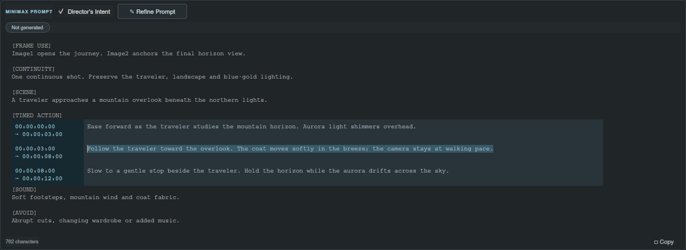

# See every beat. Shape every transition.

## Build the sequence in pictures and words

Director’s timeline gives your prompt a visual structure. Each card has a duration, a place in the story and a prompt you can edit. Mix reference images, source clips and text to describe the sequence at the level of detail you have today.


## Bring in the right material

| Segment | Use it for | Add it with |
| --- | --- | --- |
| Image | Identity, composition, an opening state or a target pose | Add media or timeline drag-and-drop; PNG, JPEG, WebP and GIF |
| Video | Source footage or movement context | Add media or timeline drag-and-drop; MP4 and WebM |
| Text | An action, pause or transition without its own reference image | Add text |

Drop media near the position where you want it inserted. The timeline shows when it is accepting a drop. Project archives and Director JSON dropped into supported project or timeline areas open or import their workspaces.

Videos use a preview frame from the clip’s final second for the timeline and AI image context. The complete source clip remains available for project storage and export. A GIF is handled as image media; use MP4 or WebM for a video segment.

## Make timing tangible

Drag a card to reorder the sequence. Drag its resize edge to change the length, or select it and enter a precise value in **Duration**. The sequence summary shows the total; each card shows its starting time. Image and video cards also show source resolution.

Use **Scale** to zoom into a passage. **Auto fit**, or the far-left scale position, brings the whole sequence into view. Drag the dotted lower grip to make the visual previews taller. Smooth horizontal scrolling helps you move through longer plans.

There is no fixed segment-count or total-length cap in the editor. The renderer you use still determines which output lengths it can produce.

## Anchor the opening and the destination

**Start frame** tells a compatible workflow to begin a segment from its supplied image. **End frame** describes the image it should reach by that segment’s end. These controls are available in LTX and MiniMax.

Select a card in LTX to edit its segment prompt. Select a connected card in MiniMax to focus and highlight its timed action in the unified editor.



## Update the image without rebuilding the beat

Use **Replace media**, or hold **Ctrl** while dropping media onto a card, to retain its duration, prompt, role and identity while changing the source. This is useful when a revised pose or a cleaner frame is ready.

An image card’s context menu includes **Copy image** and **Paste image to replace**, using the original-resolution source. For a text card, **Convert to image segment** lets you add an image while keeping the written beat. **Export image** and **Export video** place the original media in the project’s download folder.

Delete a card with its close control, the toolbar’s **Delete selected** action or the context menu. Revisit the surrounding action after a large sequence change so the written transitions still describe the plan you intend.

## Build the plan from a timed brief

In a unified workspace, paste a brief whose timed-action lines use 24 fps SMPTE ranges:

```text
00:00:00:00 - 00:00:03:00: Establish the traveler beneath the aurora.
00:00:03:00 - 00:00:08:00: Follow the traveler toward the overlook.
00:00:08:00 - 00:00:12:00: Settle into a quiet horizon hold.
```

Director matches the actions to existing segments in order, preserves their media, resizes their durations and creates text segments for extra valid actions at the end. A whole-brief paste replaces the brief; a timed-action-only paste retains the surrounding sections.

Start at zero and keep ranges continuous, ascending and nonempty. The final two digits are frames from 00 to 23. If a range is missing or invalid, unmatched cards turn gray while their media remains intact. Correct the timed block or refine the prompt to reconnect the plan.

**Continue:** [Prompt workflows](unified-workflows.md) · [Exports](workspace-definitions-and-exports.md) · [Complete feature guide](../usage.md)
