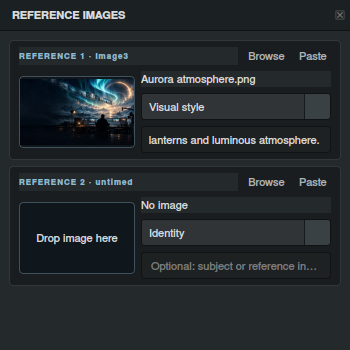

# Give every reference a purpose.

## More control over what the AI takes from an image

Use a picture to guide a face, wardrobe, atmosphere, prop or composition without placing that picture at a particular second. MiniMax’s two reference-image slots keep these visual instructions beside the timeline and the production brief.

## Add the image. Define the role.

Open **Reference images** in **MiniMax Full Reference**. Drop a local still into a slot, click **Browse**, or use **Paste** for clipboard image pixels or a local image file. Choose the role and add notes describing exactly what to use.

| Role | Guide the generation toward |
| --- | --- |
| Identity | A subject’s recognizable features |
| Wardrobe | Clothing, accessories and their details |
| Setting | Environmental or location attributes |
| Visual style | Lighting, palette, atmosphere or treatment |
| Object / prop | A particular item and its appearance |
| Composition | Framing and spatial arrangement |

For the Aurora scene, choose **Visual style** and write “Use the cool sky, warm lanterns and luminous atmosphere.” That gives the picture a clear job while the timeline continues to describe when the traveler moves and arrives.

References keep their original resolution in the saved project. AI analysis uses a size-limited copy. Roles and notes travel with the .LTXD project. Right-click the reference image and choose **Export Image** to save the full-resolution stored image into the project’s export folder. It also appears in Recent exports. Automatic filenames avoid overwriting earlier exports. **Clear** in the same context menu removes only that slot’s reference; it does not remove timeline media or change the sequence’s duration.

## Choose the right source pattern

**MiniMax** recognizes the supplied combination and prepares the prompt around it:

| Your inputs | Recognized workflow | How to direct it |
| --- | --- | --- |
| Text segments | Text to video | Describe the scene and action; use segment durations for pacing |
| One timeline image | Image to video | Describe movement from or toward the image, using its frame role |
| Two timeline images with start and end roles | First / last frame | Describe the visible path from the opening state to the destination |
| Other multiple-image timelines | Multiple keyframes | Describe the progression through the ordered visual checkpoints |
| Timeline video without images | Video to video | State whether to edit, continue or draw movement guidance from the source |
| Images and video, or an untimed reference slot | Mixed references | Explain each asset’s role and which attributes to preserve |

A start image anchors the beginning of its segment; an end image is reached at the segment’s end. Hover over the detected workflow label to inspect asset labels and checkpoint times. Video ranges follow the source metadata retained with the segment.

## References and timeline frames work together

Use **MiniMax Full Reference** to combine timeline checkpoints, source video, and two untimed image references in one production brief.

An untimed image supplies attributes rather than chronology: it does not add a segment, move a checkpoint or extend the plan. For a sequence guided entirely by the reference slots, add a text segment to establish the action and duration.

## Generate, review and refine

Write your intent and develop the segment prompts with **Magic Build**. Review reference roles in the full production draft and edit it directly. After segment changes, the **Regenerate** action in the change notice can rebuild an existing draft using the selected template.

Image labels and video labels are assigned consistently within the asset inventory. Changing a reference remains a preparation step; you choose when to submit another generation or refinement request.

**Continue:** [Prompt workflows](unified-workflows.md) · [Refinement](refinement-and-audio.md) · [Complete feature guide](../usage.md)

Drag a reference image into your file manager or the timeline to use its full-resolution image. Drop a still image from your file manager onto a reference slot to replace it. The image highlights on hover, and a blue border marks an accepted drop.
