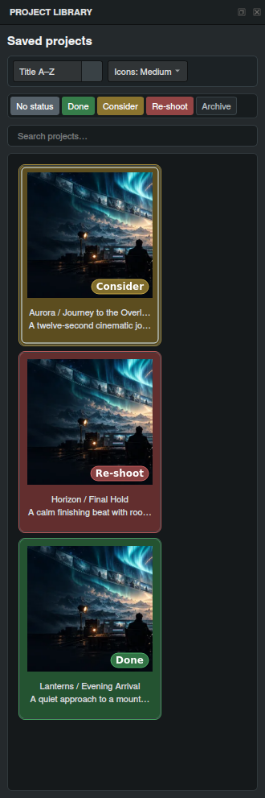
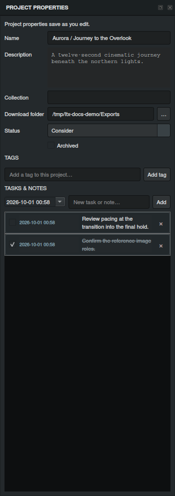

# A home for every creative project.

## Turn individual experiments into a collection of work

Your project is more than a prompt. It includes the reference media, the timing, the creative intent and the decisions that make the sequence yours. Director’s local library keeps that context together in a gallery you can browse, organize and reopen.

## Save it with a name and a cover

Choose **Save to Library**. Give a new project a name and a short description; later saves update that project. In project details, choose a segment frame as its cover or upload a custom thumbnail. A recognizable cover helps you find the right plan as the library grows.

Open **Projects** from the toolbar. Select a saved project to return to it, or use its context menu to open it or edit the details. Search matches project names and descriptions. The **Icons** menu chooses small, medium or large cards.

## Arrange the library around your work

Assign a **Collection** to group related projects. Collections appear as their own gallery tiles, with covers assembled from member thumbnails. Open a collection to browse its projects and use **UP** to return.

Choose **Title A–Z**, **Title Z–A** or **Custom** sorting. Dragging a project or collection establishes a custom order. Status and label filters help narrow the gallery; the app remembers your selected filter choices.

## Make progress visible

A project has one **Status** and can have several additional **Tags**. Status colors identify the project’s stage, and thumbnail pills show its labels. The stock status choices include Done, Consider and Re-shoot; customize names and colors in **Settings → Application**.

Archive a project when it should move out of the active flow while remaining available. Collection context actions can apply status, labels and archive choices to their members. Deletion is a separate confirmed action that removes the selected saved project.

## Put the next steps beside the plan

Open **Properties** to edit the project name, description, collection, download folder, status, archive state and tags in a dock. Metadata edits save as you work. The context-menu project-details dialog provides another way to edit the same project information.

Add dated tasks and notes, edit their text or date, check them off when complete, and remove them when they no longer apply. A note such as “Review pacing at the transition into the final hold” stays with the project instead of becoming a loose reminder elsewhere.

## Switch ideas without losing the working draft

Several saved projects can remain open as in-memory workspaces. Switching restores each project’s timeline, prompts, options and view. Use **Save to Library** to write creative edits to disk; closing the app saves dirty library projects with visible progress. Give a new unsaved project an initial library save or portable export to establish its destination.

LTX and MiniMax retain their prompt drafts across workspace changes. Projects also retain their attached review video and workflow JSON files, so you can return to the prompt and its production context together.

## Carry the complete project

**Export Project** writes a portable **.LTXD** archive to the download folder. It preserves editable sequence state, original-resolution timeline media, prompt drafts, intent and supported project attachments. **Open** restores a native project; **Import** reads Director JSON.

Timeline previews are kept separately from the original media to make navigation and loading more responsive. Original-resolution files remain the sources used for project and media exports. The preview cache can be rebuilt; keep important work in a saved project or exported archive.

## Arrange a workspace that stays comfortable

Move, resize, show or hide the project library, Properties, Preview and Project Files docks. Supported docks can float; reference images stay docked inside the main window. Panel layout and sizes are remembered. Adjust toolbar text scale from **75% to 200%** to suit your screen.

**Continue:** [Video review](video-review-and-files.md) · [Portable exports](workspace-definitions-and-exports.md) · [Complete feature guide](../usage.md)
