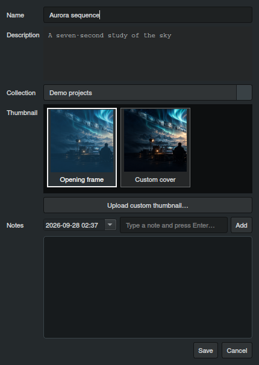

# Project performance and properties (experimental 1.13)

The experimental branch saves new `.LTXD` projects as portable ZIP archives. Each source image or video remains at its original resolution in the archive, while the timeline uses small previews from the operating system's user cache. Reopening an archive reads its metadata and previews first. The app extracts a full-resolution source only when AI input, video playback, export, or another operation requires it. Project saves stream sources into the archive instead of assembling a large JSON string of base64 media.

Existing JSON-format `.LTXD` projects still open. Save one to migrate it to the archive format. Project Export and LTX Director JSON export still include original media; cached thumbnails do not replace export sources. The cache can be discarded: it is reconstructed from project archives or original files as needed. When the preview cache is missing or older than 90 days, opening the app shows a short progress dialog while it refreshes project-library covers.

Use the **Properties** toolbar button to show or hide the dockable **Project Properties** panel. Select a library project to edit its name, description, collection, status, archive state, tags, and task checklist in place. The existing project context-menu details dialog remains available. Edits to either view update the same project metadata.

The project details dialog also offers a visual thumbnail picker for a segment frame or custom cover:

The first save after loading a legacy project can still temporarily use more memory because its old JSON embeds complete media as base64. Videos open in the preview player only when the preview dock is visible. The thumbnail cache uses the operating system's normal user cache directory and is not a backup for an unsaved source file.
