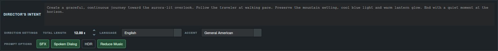

# Turn a draft into direction.

## Put the creative intent into words

A reference image shows a moment. **Director’s Intent** tells the AI how the sequence should move: the performance, the camera path, the emotional pace and what should stay consistent. Write it once and keep it visible across the stock workspaces.

For the Aurora example: “Follow the traveler at walking pace. Preserve the mountain setting, cool blue light and warm lantern glow. End with a quiet moment at the horizon.” A useful intent describes what happens between the images, as well as the result you want to reach.

Set **Total length** to guide the sequence’s pacing, or use Auto to let the initial generation suggest it. Collapse **Director’s Intent** when you want a larger writing area; its contents and options remain available when you reopen it.

## Edit directly, then refine

Write in the prompt editor as you would in any draft. In LTX, select the segment whose action needs attention. In MiniMax, work on the full production brief. **Refine Prompt** considers the text you have edited and the direction you add.

LTX’s **Refine Timing** is useful when the words are right but the beat needs a different duration. It keeps the selected prompt’s wording. Prompt refinement can change both wording and the selected duration; the rest of the LTX sequence remains intact.

## Keep requests beside the passage

Type `/`, choose a suggestion and press **Tab**. Director turns the directive into an outlined editable note. Click into the note to write or change the instruction; it supports wrapped and multiline text.

| Note | Use it to say | Example |
| --- | --- | --- |
| `/refine` · Refinement | How a nearby passage or cue should change | “Make the approach slower and describe the coat movement.” |
| `/refine-global` · Global refinement | How the entire draft should change | “Keep one continuous shot and give the final hold more room.” |
| `/keep` · Keep | Which detail should remain | “Preserve the blue-gold lighting.” |
| `/avoid` · Avoid | What the revision should exclude | “Avoid a sudden camera cut.” |
| `/focus` · Focus | Which creative element deserves attention | “Focus on the transition from walking to stillness.” |

A successfully applied global refinement note is consumed after refinement. Other notes remain as creative guidance. Remove a note through its context menu when you no longer need it. Copy and export preserve notes as readable directive text, so review the visible draft before sending it to a renderer.

## Plan the sound of the scene

**SFX** requests sound direction connected to the action: footsteps, fabric, impacts, water or environmental ambience. **Reduce Music** asks for scene-specific ambient sound to discourage unwanted music. These settings guide the generated prompt; the video model determines the final audio result.

Enable **Spoken Dialog** to expose language and accent. Both fields are editable, so you can describe the voice the scene needs. Leave them on image/context guidance when you want the supplied material to determine those attributes. Put exact wording in your intent when a specific line is required.

**HDR** adds quality-oriented prompt direction, including the LTX global quality prefix. It does not change the resolution or dynamic range of imported files.

## Polish without breaking the flow

When an installed system dictionary is available, prompt and description editors underline possible spelling errors. Right-click a word to choose a replacement. **Copy** takes the current visible editor text to the clipboard.

Request progress stays in the app. Set timeout, retry count and cooldown in **Settings → Application**; retries show their progress and provider errors explain the failed request. MiniMax also provides a retry action after an unsuccessful operation. Your configured provider handles generation and refinement; no video is rendered inside Director.

**Continue:** [Prompt workflows](unified-workflows.md) · [Installation and provider setup](../install.md) · [Complete feature guide](../usage.md)
