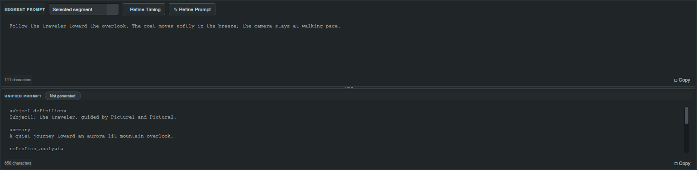
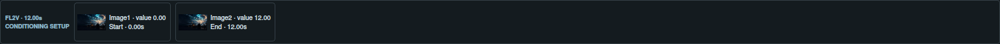

# Direct every segment. Keep the full prompt in view.

All shipped workspaces use the same segment editor. Select a timeline card to edit its prompt, change its frame role or refine its wording and duration. **Magic Build** develops the segment prompts and shared global direction.

| Workspace | Production format |
| --- | --- |
| LTX Video | Segment prompts and shared global direction for LTX Director export |
| MiniMax Standard / Keyframes | Guide-based integrated description, soundscape and music sections |
| MiniMax Full Reference | Guide-based subject definitions, summary, retention analysis, detailed description, soundscape and music |
| MiniMax Official Skill · Standard / Keyframes | Supplied skill conventions for T2VA, I2VA, FL2VA and L2VA, with project variables |
| MiniMax Official Skill · Full Reference | Supplied six-section reference skill, including companion camera, speech and sound rules |

## Edit the beats, then develop the full prompt

MiniMax adds an editable **Unified Prompt** below the segment editor. Write or paste the production draft directly. After segment changes, **Regenerate** in the change notice rebuilds it from the current segments, reference roles and creative direction using the selected template. The unified box keeps a clear writing space; segment refinement and timing remain in the upper controls.

The two editors retain separate text. Pasting or editing the unified prompt does not change the timeline. Changing segments marks the production draft as needing an update; regenerate when you want to incorporate those changes. Your manual draft remains available until you choose to replace it.

## Adjust timing through the shared editor

**Refine Prompt** above the segment editor improves the selected beat and can resize that segment when the requested action or dialogue needs a different duration. **Refine Timing** changes its duration while preserving its wording. Both update the timeline in LTX and MiniMax. In MiniMax, each button then generates the unified production prompt from the updated segment prompts, timing, references and creative direction.

Select **Global** in the segment editor to edit shared direction. Add an instruction such as `/refine-global Resize the segments proportionally to 15 seconds`, then choose **Refine Prompt**. Director scales the current segment durations to the requested total while preserving their proportions and individual prompt text. Other explicit global timing edits can change multiple segment durations. In MiniMax, the unified production prompt is then generated from the updated sequence. Manual segment edits preserve the draft until you request generation or refinement.

## Check conditioning at a glance

The compact strip under the MiniMax timeline shows image thumbnails, explicit MiniMaxCondFrame **value** settings in seconds, start/end checkpoint times, source-video trim ranges and untimed reference roles. It flags an opening that needs to move to zero or an ending that needs to reach the sequence total. It describes your setup; it does not move media automatically.

Both MiniMax templates receive `${workflow_name}` and `${workflow_direction}` from the current asset setup, including I2V, FL2V and last-frame L2V. Asset labels, subjects and speakers remain distinct. Dialogue requests can add original spoken lines when none are supplied.

## Keep your direction and drafts

**Director’s Intent**, prompt options and inline refinement notes remain available across modes. The native splitter below it uses the same handle as the split between the segment and unified prompts. Drag up to collapse and down to reopen; its height and collapsed state persist. Switching workspaces does not submit an AI request. Projects retain segment prompts, global direction and each workspace’s unified draft.

**Continue:** [Reference images](minimax-references.md) · [Custom workspaces and exports](workspace-definitions-and-exports.md) · [Complete feature guide](../usage.md)

The Official Skill variants are additional defaults. They receive the detected workflow, duration, asset map, Director’s Intent, global direction, sound/dialogue/music options, and current prompt and instructions during refinement. Their worked-example subjects and timings are format illustrations, never preset content for your scene.

For two end-frame segments lasting 3.0 and 7.5 seconds, the condition values are **3.0** and **10.5**. End frames use the cumulative segment ending time; start frames use the cumulative segment starting time. These are absolute target-video times, not each segment’s duration or a frame count. The strip is a setup guide; it does not modify external ComfyUI nodes.
