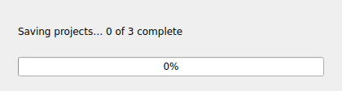

# Unified project workflows — 1.13.0a18

Experimental branch: `experimental/unified-project-workflows`. Stable `main` remains
on 1.12.57. This experiment brings all MiniMax controls into the main timeline window.


## One editor

| Project type | Shared editor | Generate | Refine |
| --- | --- | --- | --- |
| LTX Video | Selected segment; changes when a timeline segment is clicked | All segment prompts and the global prompt | Selected segment |
| MiniMax · Frames | Full continuous production prompt | Frame-timeline generation | Full edited prompt plus inline directives |
| MiniMax · References | Full production brief | Locally detected T2V/I2V/FL2V/keyframes/V2V/R2V generation | Full edited brief, references, and inline directives |

LTX's Global prompt is available from the selector beside the editor heading. It uses the
same text box. Switching to Global does not overwrite any segment prompt. MiniMax keeps
its production prompt visible when selecting, retiming, or reordering timeline items.
The LTX segment prompts remain in project storage and continue to provide timeline context
to MiniMax generation.

Generate and Refine are manual actions. Changing project type or dropping a reference
never calls an AI provider. Frame and Reference drafts, including inline refinement notes,
are stored independently. The existing LTX prompts and global context survive mode changes.

## Controls

- One Generate action routes to the selected project type. One Refine action targets the
  active segment or the full MiniMax prompt. Copy copies exactly the visible editor text.
- Direction & audio opens the shared Director's Intent and generation options. It starts
  expanded in every workspace; intent, total length, and prompt options persist across modes.
- MiniMax hides LTX JSON export, output dimensions, and per-segment AI retiming. Total length and HDR direction remain available. The separate Gemini image-prompt copy action has been removed.
- Start/end roles are available for LTX and MiniMax References visual segments. Frames mode
  continues to use segment-start checkpoints and does not expose unused end-frame controls.
- Language and accent appear when Spoken Dialog is enabled.
- The two untimed reference slots live in a dock inside the main window in both MiniMax
  modes. Reopen it with Reference images. It cannot become a floating window.
- Slash directives are editable notes inside the shared editor; copying and exporting serialize them as readable prompt text.
- The extra MiniMax window, duplicate pacing strip, parallel generation buttons, and the
  always-visible second global prompt box have been removed.

## Editable workspaces, timed paste, and exports

Workspaces now load from exportable JSON definitions. Settings includes the full generation and refinement templates, layout and reference capabilities, create/rename/delete/import/export controls, and a stock restore action that preserves custom definitions.

Pasted SMPTE action ranges conform existing segments in ascending order and can add new text segments. AI generation and refinement return explicit start/end/action records and use the same reconciliation path. Missing or invalid ranges detach and disable unmatched timeline tiles until corrected. Clicking a connected tile focuses and highlights its entire action cell.

All external exports use the project download folder with automatic collision-safe names. The toolbar download button pulses on completion and opens a dismissible history popup with native file dragging.

See [workspace definitions, timed paste, and export history](workspace-definitions-and-exports.md) for the format and behavior.

## Project storage and running requests

Project format 8 records `projectType` and both MiniMax drafts in `minimaxH3.drafts`.
The active draft is also written to the existing `minimaxH3.prompt` fields. Existing project
files remain readable: an older saved MiniMax prompt selects its recorded MiniMax mode;
a project without one opens in LTX mode. Switching between open project sessions restores
each project's type and drafts. LTX imports start with fresh MiniMax state.

**Save to Library** in the toolbar writes the current project archive, and closing the app
saves dirty library projects. **Project Export** creates a portable `.LTXD` copy. A new
project needs an initial library save or explicit project export.

AI results and errors from a previous project or workflow are discarded. Reference or
prompt edits during a MiniMax request also reject an outdated response. The editor stays
editable during MiniMax generation. No live provider request was made for automated testing.

## Install this experimental wheel

```bash
python3 -m pip install --upgrade 'https://raw.githubusercontent.com/etoven/ltx-director-director/experimental/unified-project-workflows/dist/ltx_prompt_director-1.13.0a18-py3-none-any.whl'
```

To return to the stable build, install its wheel explicitly:

```bash
python3 -m pip install --force-reinstall --no-deps 'https://raw.githubusercontent.com/etoven/ltx-director-director/main/dist/ltx_prompt_director-1.12.57-py3-none-any.whl'
```

### MiniMax Frames brief (1.13.0a3)

Frames generation now uses the same production-brief layout as References, with `[FRAME USE]`, `[CONTINUITY]`, `[SCENE]`, `[TIMED ACTION]`, `[SOUND]` and `[AVOID]` as applicable. `[TIMED ACTION]` uses the exact timeline intervals in `00:00:000 - 00:03:000: ...` form. A start image anchors the beginning of its interval and an end image must be reached at its interval end. The images are timed conditioning checkpoints, while untimed images in References mode are guides for selected attributes. Generation and refinement return the authored brief directly without inserting extra bridge slots or changing user-edited wording.

### MiniMax Frames references and line layout (1.13.0a4)

Both MiniMax modes now expose the same two untimed reference-image drop targets. In Frames mode, those images keep their selected attribute roles and notes; they never become timeline checkpoints or add duration. The Frames prompt asks for a blank line between bracketed sections and one complete `MM:SS:mmm - MM:SS:mmm:` range per line inside `[TIMED ACTION]`, following the example production brief. Manual refinement receives the same two reference images while respecting edits already made in the shared prompt editor.

### Responsive projects and inline spelling (1.13.0a5)

Media imports, portable project saves and loads, metadata ZIP updates, and LTX JSON exports now run in Qt background workers. AI requests already run in separate workers. New project selections invalidate unfinished older loads, and closing waits for pending disk work. The existing prompt, intent, refinement, and description text boxes mark misspellings inline and offer right-click suggestions using the installed Enchant system dictionary. On Linux install an Enchant provider and a dictionary for your locale if one is not already available; without a matching dictionary the text boxes remain editable without spell marks.

MiniMax Frames and References prompts now request 24 fps, non-drop-frame SMPTE `HH:MM:SS:FF` timecode, with `FF` as a frame number from 00 to 23. Each timed range occupies one line and sections are separated by a blank line. Frame boundaries from the app's second-based timeline are rounded to the nearest frame, which can differ by up to half a frame from a millisecond timestamp.

### Linked MiniMax cues and automatic projects (1.13.0a6)

MiniMax Frames and References request ordered `timed_actions` alongside the remaining brief in JSON. The client assembles SMPTE cue boundaries from timeline segment lengths. Compact per-segment action controls edit the same `[TIMED ACTION]` section as the shared production editor; retiming and rearranging update cue boundaries locally and show a yellow refine prompt action for continuity review. Ctrl+drop media onto an existing timeline tile replaces that segment while retaining its duration, prompt, role and ID. Projects save in the background after edits and when switching or closing; the tile action row and unsaved badges have been removed. Project operations remain in the tile context menu. Spelling suggestions appear directly at the top of the editor context menu.

### Save queue correction (1.13.0a7)

Edits made during a pending archive write enqueue a fresh snapshot when the project changes, so a fast switch or close still persists the latest version.

### Inline timed actions (1.13.0a8)

Removed the duplicate MiniMax timed-action controls and their scroll area. Timed cues live only in the shared production QTextEdit, wrap at word boundaries, and receive a subtle line tint for orientation. Editing a cue updates the linked timeline prompt; timeline edits retime the cues while retaining the prose. Retiming preserves the editor cursor and scroll position.

### Native MiniMax cue cells, deliberate saves, and close progress (1.13.0a9)

MiniMax timed actions now live in wrapping, editable Qt table cells at their actual positions in the shared prompt editor. Each cell stores its timeline segment ID in its document format; cue text is also persisted by ID in the project archive. Surrounding prose edits cannot shift these associations. Projects keep edits in memory across switches and write archives only from the top toolbar's **Save to Library** command or when the app closes. **Export Project** still writes a portable copy on request. On close, the main window hides, a modal project-save progress dialog remains visible, and the window is disposed of after background writes finish. The spelling menu's suggestion actions use Qt QAction objects, restoring right-click replacements at the top level.

### Whole-cue highlighting and protected timecodes (1.13.0a10)

Timed cues now use two styled cells inside the same prompt editor: a narrow, protected timecode column and a wrapping action column shaded across every line. The prompt sent to MiniMax remains the normal one-line SMPTE interval format. Keyboard editing, paste and cut cannot remove the timecode cell or its table; mismatched additional cues remain visible instead of being silently discarded during timeline changes.

### Flexible refinements and whole note pills (1.13.0a13)

LTX timing and prompt refinements may change the selected segment duration beyond the requested sequence length when the action calls for it. Other segment durations stay fixed, and an expanded timeline keeps its scale so the longer segment grows visibly. Failed model responses and transient HTTP errors retry according to the configured retry count and cooldown, with the countdown visible in the status bar; a final failure restores the controls. The close progress dialog paints before project snapshots start saving. Global refinement notes use a full-width rounded block with their editable instruction below the label. Local inline directives use compact rounded notes. Both styles preserve the directive and body when saving and restoring prompts.

### Completed global refinements (1.13.0a14)

Successful LTX or MiniMax prompt refinement consumes `/refine-global` notes, including multiline instructions. Other slash directives remain in the refined prompt. Failed or discarded responses leave the original notes in place for another attempt.

### Clear note outlines and closing progress (1.13.0a15)

The shared prompt editor renders slash directives as editable, rounded outline notes without inner badges or cell shading. Small bottom-right labels identify Refinement, Global refinement, Keep, Avoid, and Focus. Box padding, border insets and spacing are balanced across full-width and compact notes. The close progress dialog has a fixed 420 × 112 logical-pixel footprint that can grow for larger system fonts; it cannot be resized by dragging.





### Workspace definitions and connected exports (1.13.0a16)

Shared intent and length controls, cue navigation, structured timing plans, protected timed-block paste, partial-conformance recovery, editable filesystem workspace templates, and Recent exports now work together in the main window. Stock full master prompts are stored in the installed definition templates. Project JSON manifests are compressed while full-resolution media remains stored for quick recovery and export.


### Collapsible direction and Generic engine (1.13.0a17)

The Director’s Intent checkbox collapses the direction panel in every workspace and preserves its state across mode changes, prompt refreshes, and app restarts. Generic is available in the workspace definition editor and supports unified or segmented layouts through neutral, editable generation and refinement templates.


### MiniMax text and media cue repair (1.13.0a18)

Adding a text or media timeline item to a valid MiniMax plan inserts a linked timed-action block at its timeline position. Empty action blocks remain distinct while editing. MiniMax generation accepts common production-prompt response fields and preserves valid timed actions if the provider omits the surrounding brief.
