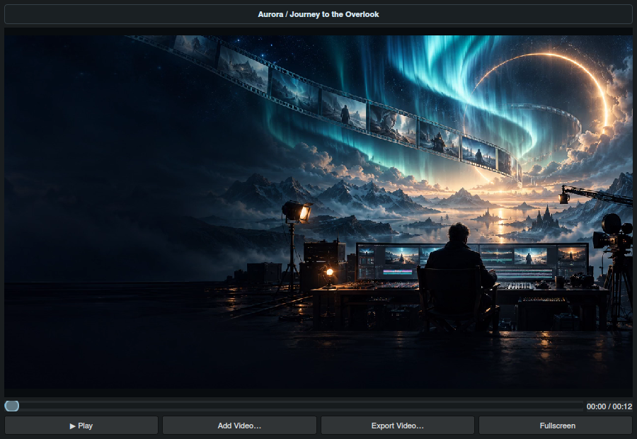
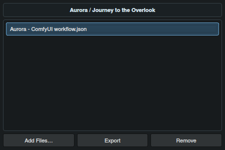

# Bring the finished motion back to the plan.

## Review in the same place you directed

After rendering in your video workflow, bring the result into Director. Keeping the video beside the prompt and timeline makes it easier to judge pacing, spot a transition that needs work and choose the frame for your next pass.

## Attach and play a render

Save or open a library project, then open **Preview** from the toolbar. Drop the rendered video into the preview area or choose **Add Video**. Supported review files include MP4, WebM, MOV, MKV, AVI and M4V; successful playback also depends on the available codec support.

The project keeps its own attached video copy. Use **Play** and **Pause** to review the motion. Click the preview’s playback bar to jump to a moment. **Fullscreen** opens a larger player with its own controls; return to the dock when you want to compare the result with the prompt.

The preview loads the saved video when its dock is opened. **Export Video** copies the attached render into the project download folder for reuse or sharing.

## Capture the moment you need

Pause on a useful frame and right-click the video. Choose **Export Current Frame** to save a PNG in the download folder, or **Copy Current Frame to Clipboard** to place the decoded frame on the clipboard. These actions are also available from the fullscreen video surface.

Use the copied frame to replace an image segment, or save it as a new visual checkpoint. Frame capture uses the decoded video image rather than the on-screen player size. It becomes available after a video frame has loaded.

## Keep the workflow with the project

Open **Project Files** and add or drop ComfyUI workflow JSON. Keep several workflow attachments when a project needs alternative rendering setups. Select one to export it to the download folder or remove it from the project.

Attaching files does not run the workflow. It keeps the rendering setup available alongside the visual plan, and portable project exports can carry the supported attachments with them.

## A practical next-pass workflow

1. Render the exported plan in your chosen video pipeline.
2. Attach the result to its Director project and review the pacing.
3. Capture a useful frame or identify the beat that needs attention.
4. Update the relevant image or inline refinement note.
5. Refine, export and keep the revised plan in the same project.

**Continue:** [Media replacement](media-and-timeline.md) · [Project organization](performance-and-properties.md) · [Exports](workspace-definitions-and-exports.md)
