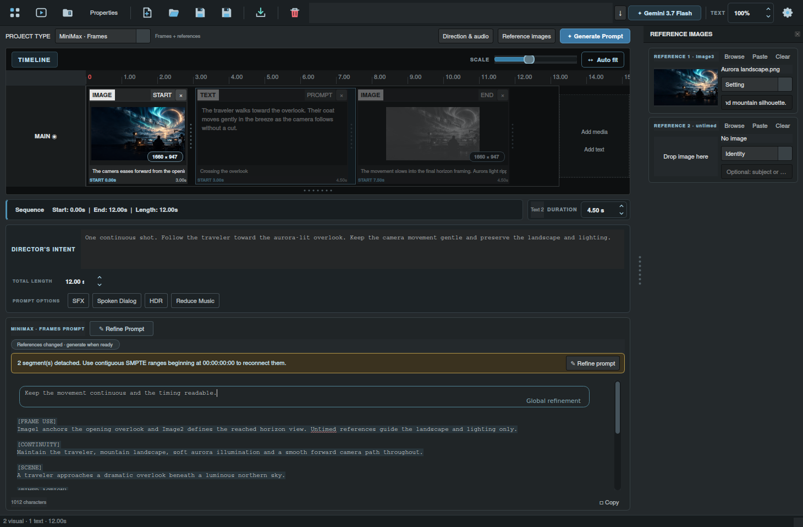

# Workspace definitions and export history

Aurora 1.13.0a16 adds editable workspace templates, timecode-driven timeline reconciliation, and one destination for exports.

## Define the workspace

Open **Settings → Workspaces**. Every stock workspace is an editable JSON definition: **LTX Video**, **MiniMax Frames**, and **MiniMax References**. Definitions load at startup from the application's data folder, under `workspaces/`. The wheel includes the original templates under `ltx_prompt_director/workspace_templates/`.


| Field | Purpose |
| --- | --- |
| ID and name | Stable project identity and the label in the workspace selector |
| Generation engine | LTX, MiniMax Frames, or MiniMax References input handling and response validation |
| Prompt layout | One unified production prompt or per-segment prompts |
| Global prompt | Whether a segmented workspace exposes a global prompt |
| Audio generation | Whether audio generation controls are available |
| Reference media and kinds | Permitted timeline media and untimed image attributes |
| Untimed image slots | Zero, one, or two image targets; available to MiniMax engines |
| Generation and refinement instructions | Full editable master templates used by the AI worker |

Select a workspace and edit it, including a stock workspace, then choose **Save / rename**. **New** creates a definition you can customize. **Delete** removes the selected definition. **Import** reads a definition JSON file; a matching ID is overwritten. **Export** writes the edited definition to the project's download folder and adds it to Recent exports.

**Restore stock** overwrites the three stock IDs with the installed templates. It preserves every other custom definition. Deleted stock definitions stay deleted across restarts until restored.

Templates use data substitutions such as `${director_intent}`, `${current_prompt}`, `${intervals}`, and `${asset_map}`. The editor lists the fields for the selected definition. These substitutions cannot run code. The generation engine still enforces its JSON response contract and validates returned durations. A new definition configures the existing engines; it does not install a new video model or renderer. LTX uses segmented prompts and timeline frames; MiniMax uses unified prompts and can also use untimed images.

Projects store their workspace ID and a portable copy of the definition. When importing a project whose definition is missing locally, the embedded definition is installed. An existing local definition with that ID is preserved.

## Keep prompt and timeline connected

Director's Intent, total length, and generation options remain available across workspaces. Clicking a connected segment in a unified workspace focuses its inline action cell and highlights the whole action, including wrapped lines.

Paste a production brief or a `[TIMED ACTION]` block containing lines such as:

```text
00:00:00:00 - 00:00:03:00: Opening action.

00:00:03:00 - 00:00:07:12: Following action.
```

Ranges use non-drop-frame SMPTE `HH:MM:SS:FF` at **24 fps**, with frame values `00–23`. The client matches cues to existing segments in ascending order, preserving segment IDs and media. Durations conform to the ranges, and extra valid cues at the end create text segments. Resizing uses the same sliding animation as Magic Build. Frame precision survives project saves.

A complete timed brief paste replaces the production brief. A cue-only paste replaces the timed-action section while retaining other sections. This replacement route can cross protected cue tables; normal typing, cutting, and deleting still cannot remove the timecodes or cue table itself.

Ranges must begin at zero and remain contiguous, ascending, and nonempty. A malformed range, gap, overlap, or missing cue detaches that segment and the subsequent unmatched portion. The connected prefix remains usable. Detached timeline tiles appear gray and cannot be edited through timeline controls; their media stays intact. Correct the timed block with another paste or use **Refine prompt** to reconnect it.



MiniMax generation and refinement return a structured plan alongside the production brief:

```json
{
  "prompt": "[SCENE]\nA continuous shot.\n\n[TIMED ACTION]\n\n[SOUND]\nWind.",
  "timed_actions": [
    {"start": "00:00:00:00", "end": "00:00:03:00", "action": "Opening action."},
    {"start": "00:00:03:00", "end": "00:00:07:12", "action": "Following action."}
  ]
}
```

The client reparses successful results, applies duration changes, and adds extra action segments. Legacy string arrays remain supported when they match the existing segment count. Invalid model responses retain the existing retry and failure behavior.

## Export once, find it in one place

Set **Download folder** in Project Properties, either in the dock or the context-menu dialog. Leave it blank to use **Settings → Application → Default download folder**.

Image and video exports, captured video frames, portable `.LTXD` projects, LTX Director JSON, attached project files, and workspace definitions all use this destination. No export filename dialog is required. Names derive from the project, segment, or source file; duplicates become `Name (1).ext`, `Name (2).ext`, and so on.


When an export completes, the toolbar download button pulses, gains a badge, and briefly shows the exported filename. Click it to open **Recent exports**. Click outside to dismiss the popup. The newest file is highlighted. Double-click a file to open it, right-click for Open/Open folder, or drag it into another application using native file URLs. History persists across app restarts; entries whose files were moved or deleted are disabled.

Library saves still keep projects in the internal project library. **Export Project** creates the portable copy in the download folder.
