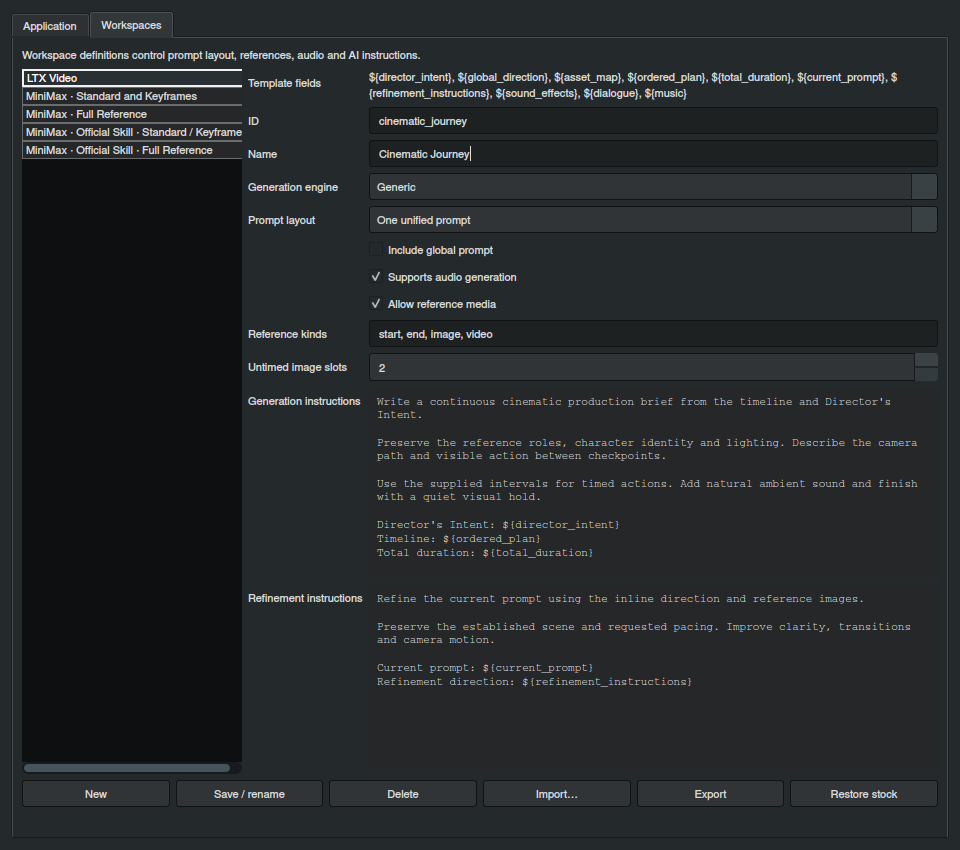

# Make the workspace yours. Take the result with you.

## Give every output a clear destination

Director brings prompts, source media and portable projects into your production workflow with distinct actions for each purpose.

| What you want to take out | Action | Result |
| --- | --- | --- |
| Visible prompt text | Copy in the editor | Clipboard text for your generation workflow |
| Editable project and media | Export Project | Portable .LTXD archive |
| LTX timeline, prompts and media references | Export in LTX Video | Director JSON for ComfyUI |
| Original segment image or clip | Export image / Export video on a timeline card | Original source media file |
| Attached rendered video | Export Video in Preview | Copy of the project render |
| Current video frame | Video context menu → Export Current Frame | PNG captured from the decoded frame |
| Attached workflow JSON | Export in Project Files | The selected attachment |
| Custom workspace setup | Export in Settings → Workspaces | Reusable workspace-definition JSON |

## One folder. A visible handoff.

Set **Download folder** in project Properties for a project-specific destination. Leave it blank to use **Settings → Application → Default download folder**. Exports receive descriptive automatic names; repeated names get numbered suffixes so an earlier output remains available.

The download button signals completion with a pulse and badge. Click it for **Recent exports**. Open a file with a double-click, use the context menu for **Open folder**, or drag selected files into another application. Click inside the app outside the tray to dismiss it; switching to another window keeps it open. Use the broom to clear history. History remains available after restarting the app; moved or deleted files are marked unavailable.

**Save to Library** stores the editable project inside Director’s local gallery. **Export Project** creates the portable copy in your download folder. Use both when you want a working library project and a handoff archive.

## Connect the LTX plan to ComfyUI

Set the desired output width and height in LTX’s timeline header, then choose **Export**. Configure the **ComfyUI working directory** in Application Settings so Director can place media in the workflow’s input area.

Director JSON includes segment timing at 24 fps, prompt text, frame roles, supported video metadata and global direction. Text-only segments retain their type. When an imported video contains audio, export can extract and include its soundtrack as an audio segment for the receiving workflow. Export defaults include crop resizing and audio inpainting.

Use **Import** to reopen a supported LTX Director JSON timeline. It restores supported image, video and text segments and global context; it is not an editor for every ComfyUI node or specialized track. For the complete native working project, use .LTXD.

## Design a workspace around your process

Open **Settings → Workspaces**. Stock and custom definitions let you choose the editor structure and the instructions used for prompt generation and refinement.

| Setting | Creative control |
| --- | --- |
| Name and ID | Recognizable selector name and reusable workspace identity |
| Generation engine | LTX, MiniMax Frames, MiniMax References or Generic |
| Prompt layout | One unified production prompt or individual segment prompts |
| Global prompt | Shared direction where supported by the segmented setup |
| Audio generation | Availability of audio-direction controls |
| Reference media and kinds | Which source types and reference attributes the workspace accepts |
| Untimed image slots | Up to two visual-reference targets where supported |
| Generation instructions | Your master direction for creating a first draft |
| Refinement instructions | Your rules for developing the edited draft |

Choose **New**, set the name, engine and layout, then write the generation and refinement instructions. **Generic** supports a unified or segmented layout for your own prompting approach. Its templates configure prompt authoring; they do not install or run a video model.

## Reuse the direction you like

Templates can include the supported fields listed in the editor, such as Director’s Intent, the current prompt, ordered plan and total duration. Use these fields to blend project context with your preferred camera, continuity or writing rules.

Choose **Save / rename** to keep the definition, **Export** to share or reuse it, and **Import** to load a definition JSON. An import with a matching ID replaces that local definition. **Restore stock** brings back the included definitions while preserving custom definitions with other IDs. **Delete** removes the selected definition.

Native projects carry their workspace identity and a portable definition. Opening a project can install its definition when it is missing locally; an existing local definition with the same ID takes precedence. This lets you carry a setup with the project while continuing to manage your local templates.

**Continue:** [Prompt workflows](unified-workflows.md) · [Application setup](../install.md) · [Complete feature guide](../usage.md)

The shipped defaults are LTX Video, two guide-based MiniMax templates and two Official Skill variants of Standard / Keyframes and Full Reference. Upgrades replace untouched old MiniMax factory definitions and preserve custom definitions. Unified workspaces share the segment editor and keep a separate production draft below it.
