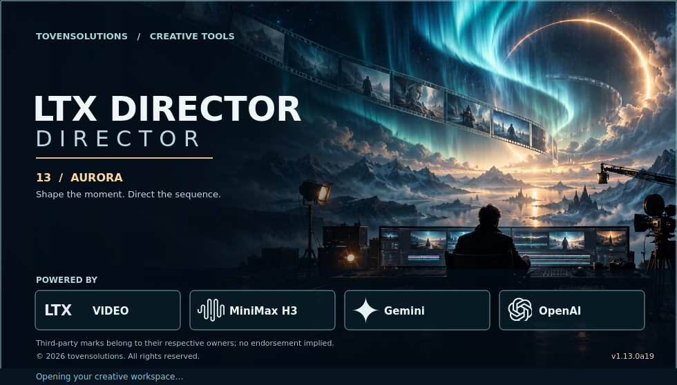
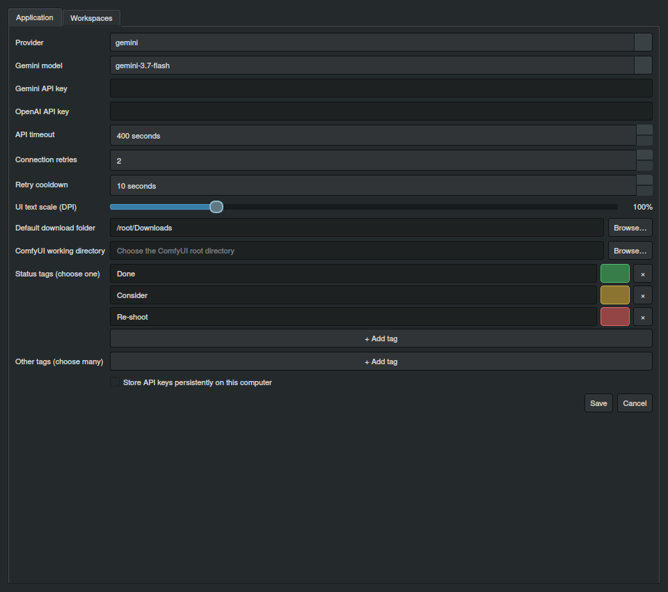

# Start directing with Aurora.

## Your desktop workspace for AI video planning

Install Director, open a project and start arranging your sequence. Timeline editing and project organization work locally. Connect Gemini or OpenAI when you want help generating or refining prompts.



## Install the current experimental build

You need **Python 3.10 or newer** and a desktop environment supported by Qt 6. A virtual environment keeps Director’s dependencies separate from other Python applications.

### Linux and macOS

```bash
python3 -m venv ~/.venvs/ltx-director
source ~/.venvs/ltx-director/bin/activate
python -m pip install --upgrade pip
python -m pip install --upgrade 'https://raw.githubusercontent.com/etoven/ltx-director-director/experimental/dist/ltx_prompt_director-1.13.0a19-py3-none-any.whl'
ltx-director-director
```

### Windows PowerShell

```powershell
py -m venv "$env:USERPROFILE\ltx-director-venv"
& "$env:USERPROFILE\ltx-director-venv\Scripts\Activate.ps1"
python -m pip install --upgrade pip
python -m pip install --upgrade 'https://raw.githubusercontent.com/etoven/ltx-director-director/experimental/dist/ltx_prompt_director-1.13.0a19-py3-none-any.whl'
ltx-director-director
```

The package installs Qt components, image handling and the bundled FFmpeg helper. Review-video playback also depends on codec availability on the system.

## Connect your prompt-writing provider

Open **Settings → Application**, select **Gemini** or **OpenAI**, and enter the corresponding API key. Choose a Gemini model when using Gemini. Set the request timeout, additional retry attempts and cooldown to fit your provider.



API keys can be retained for the session or stored through the app’s persistent-key option. Use persistent storage on a computer you trust. Keys are excluded from portable project exports. AI requests send the selected project context to the provider; local editing and project storage do not require an AI call.

## Set up your working space

Set a default download folder for exports and a ComfyUI working directory for LTX JSON handoff. Customize status tags and other labels. Adjust text scale from 75% to 200%, either here or from the main toolbar. Open **Workspaces** when you want to customize prompt layouts and master instructions.

On Linux, the first launch installs an application-menu shortcut for the current installation. Refresh it manually with:

```bash
ltx-director-director-install-desktop
```

Remove that shortcut with `ltx-director-director-uninstall-desktop`. Keep the virtual environment in place while its launcher is in use.

## Run from source

```bash
git clone --branch experimental https://github.com/etoven/ltx-director-director.git
cd ltx-director-director
python3 -m venv .venv
source .venv/bin/activate
python -m pip install --upgrade pip
python -m pip install .
ltx-director-director
```

On Windows, use `py -m venv .venv` and activate `.venv\Scripts\Activate.ps1`. Use the `main` branch for the stable line and `experimental` for Aurora development.

## When a desktop dependency needs attention

On Ubuntu or Debian, an error naming a missing XCB component can be resolved with `sudo apt install libxcb-cursor0 libxkbcommon-x11-0`. If the named missing library is `libEGL.so.1`, install `libegl1`.

For inline spelling suggestions, install an Enchant provider and a dictionary for your language. The editors remain usable without a matching dictionary.

If startup reports missing PySide6 modules, activate the environment used to run Director and reinstall the wheel with `python -m pip install --force-reinstall` followed by the wheel URL above. For a provider error, check the selected model, API key, quota and connection in Settings.

**Ready for the first sequence? [Open the complete feature and usage guide →](usage.md)**
