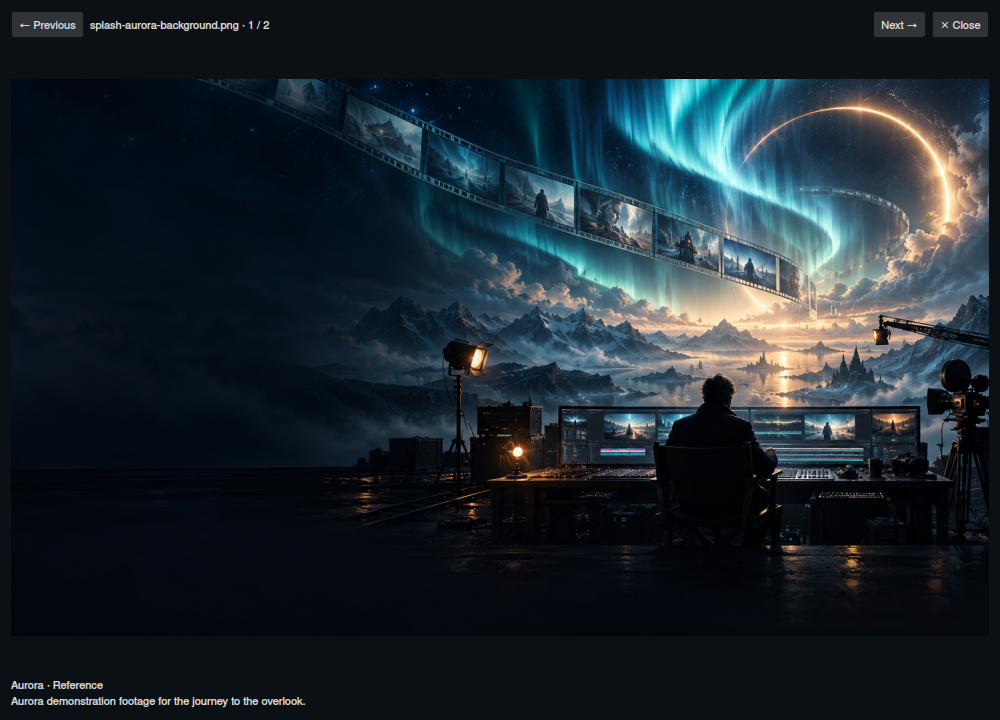
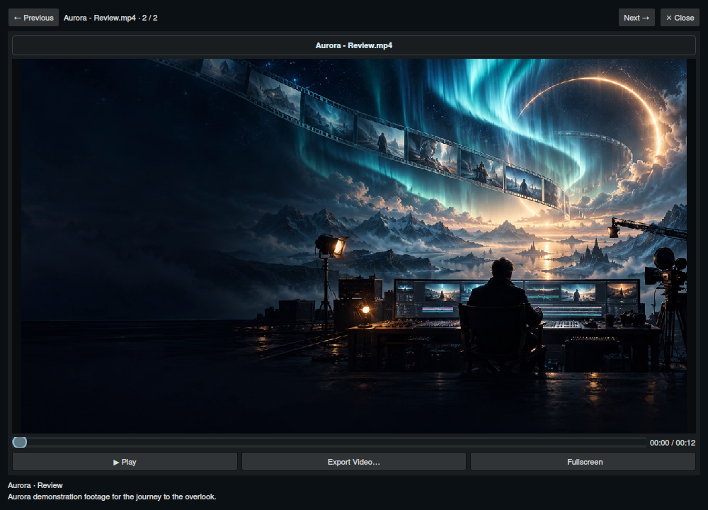

# Your complete guide to Director

## From visual idea to production-ready plan

Start with an image, a video clip or a written beat. Arrange the sequence, describe the motion you want, and turn the plan into a prompt you can shape. Director keeps the timing, media and words together as your idea develops.

*The examples throughout this guide use the current 1.13.0a27 native interface with a locally authored Aurora demonstration project.*

## Your first sequence

1. Open **Settings**, choose Gemini or OpenAI and enter that provider’s API key. You can edit and organize projects before configuring AI.
2. Choose **LTX Video**, **MiniMax Standard / Keyframes** or **MiniMax Full Reference** from **Project type**.
3. Use **Add media** or drop supported images, MP4 or WebM clips onto the timeline. Use **Add text** for a beat described in words.
4. Arrange the segments and set their durations. Expand **Director’s Intent**, describe the sequence, and choose a total length or Auto.
5. Select **Magic Build** to develop segment prompts. In MiniMax, choose **Generate Unified Prompt** below the shared segment editor to combine them. Review the generated text and refine it as needed.
6. Use **Save to Library** to name and retain the project. Copy the MiniMax brief or use **Export** for LTX Director JSON.

AI generation is an explicit action. Switching workspaces and adding media let you prepare the plan before submitting a request.

## Every creative tool, at a glance

| Tool | What it helps you do | How to use it |
| --- | --- | --- |
| Image segments | Establish visual checkpoints | Add or drop PNG, JPEG, WebP or GIF media |
| Video segments | Bring source motion into the plan | Add or drop MP4 or WebM clips |
| Text segments | Plan action before a reference exists | Click Add text, then write the beat in the editor |
| Drag reordering | Change the sequence’s progression | Drag a timeline card to its new position |
| Segment duration | Give each action the time it needs | Drag the resize edge or edit the Duration control |
| Frame roles | Identify where an image anchors a beat | Select Start frame or End frame where the workspace supports it |
| Timeline scale | Inspect details or the whole sequence | Use Scale or Auto fit; the far-left scale setting fits the sequence |
| Preview height | Make references easier to see | Drag the dotted grip below the timeline |
| Start-time and resolution labels | Check placement and source size | Read the labels on image and video cards |
| Media replacement | Update a reference while retaining its beat | Use Replace media or Ctrl+drop onto a card |
| Image clipboard tools | Reuse or swap original images | Right-click an image: Copy image or Paste image to replace |
| Text-to-image conversion | Turn a written beat into a visual one | Right-click a text card and choose Convert to image segment |
| Director’s Intent | Set the creative throughline | Describe action, camera, continuity and mood in the shared panel |
| Total length | Guide sequence pacing | Enter a target duration or choose Auto |
| SFX | Request environmental and action sounds | Enable SFX before generation or refinement |
| Spoken Dialog | Guide a speaking performance | Enable Spoken Dialog and set language and accent |
| HDR | Add quality direction | Enable HDR; it adds prompt guidance, rather than changing the source media |
| Reduce Music | Favor scene-specific ambience | Enable Reduce Music for ambient-sound direction |
| Magic Build | Develop the entire LTX plan | Generate segment prompts and global direction from the ordered timeline |
| LTX global prompt | Establish shared continuity | Select Global from the prompt-scope control |
| Refine Prompt | Improve wording and pacing | Refine a segment or Global direction in any mode; separately refine the MiniMax unified draft |
| Refine Timing | Adjust an LTX beat’s duration | Select the segment and choose Refine Timing |
| Inline notes | Keep edit requests near their subject | Type `/`, choose a note and press Tab |
| Spelling suggestions | Polish prose as you work | Right-click an underlined word when a system dictionary is available |
| Shared segment editor | Edit and retime individual beats | Select a card in LTX or MiniMax; the unified draft stays independent |
| Timed prompt paste | Reshape the timeline from a written plan | Paste contiguous 24 fps SMPTE ranges into the unified editor |
| Two reference slots | Guide untimed visual attributes | Drop, browse or paste images; choose roles and enter notes |
| Independent drafts | Explore different prompting approaches | Switch between LTX and MiniMax; each workspace retains its own prompt draft |
| Prompt copy | Send the visible text into your workflow | Use the editor’s Copy button |
| Project library | Keep an accessible portfolio of plans | Save to Library, then open Projects |
| Collections | Group related creative work | Set a collection in project details or Properties |
| Search and sorting | Find or arrange saved projects | Search names/descriptions; sort A–Z, Z–A or Custom |
| Status, tags and archive | Track progress visually | Set one status, add multiple tags and archive finished work |
| Tasks and dated notes | Keep next steps with the project | Add, edit, complete or delete notes in Properties |
| Custom project covers | Recognize work at a glance | Choose a segment thumbnail or upload a cover in project details |
| Multiple open projects | Move between active ideas | Switch saved projects while retaining in-memory edits |
| Portable project archive | Carry the editable plan and media | Choose Export Project for a .LTXD file |
| Project video preview | Review the rendered result | Open Preview and add or drop a rendered video |
| Playback and fullscreen | Inspect pacing and detail | Play/pause, click the seek bar or choose Fullscreen |
| Frame capture | Reuse a moment from the render | Right-click the video to export or copy the current frame |
| Project Files | Retain the rendering setup | Add or drop workflow JSON, then export or remove attachments as needed |
| LTX Director JSON | Hand off the planned sequence | Choose Export in the LTX workspace |
| Download folders | Keep each project’s output together | Set a project folder in Properties or an application default in Settings |
| Recent exports | Find and move finished files | Click the download button, open a file or drag it to another app |
| Custom workspaces | Fit the editor to your process | Open Settings → Workspaces and edit or create a definition |
| Generic engine | Use your own prompting instructions | Choose Generic and a unified or segmented layout |
| Workspace import/export | Reuse a preferred setup | Import or export a workspace definition |
| Dockable panels | Arrange your working space | Move, resize, hide or float supported docks |
| Text scaling | Make the interface comfortable | Set toolbar text scale from 75% to 200% |
| Request controls | Manage provider delays | Configure timeout, retries and cooldown in Settings |

## Learn each workflow

Follow the illustrated guides for practical examples:

- **[Timeline and media](docs/media-and-timeline.md):** build, rearrange, resize and update every beat.
- **[Prompt workflows](docs/unified-workflows.md):** choose MiniMax, LTX or a custom editor and develop the sequence.
- **[Refinement and audio direction](docs/refinement-and-audio.md):** edit with intent, preserve key details and guide sound or dialogue.
- **[MiniMax references](docs/minimax-references.md):** assign visual roles and combine text, frames and source video.
- **[Projects and organization](docs/performance-and-properties.md):** manage your gallery, collections, labels, notes and portable projects.
- **[Video review and project files](docs/video-review-and-files.md):** inspect renders, capture frames and retain workflows.
- **[Exports and custom workspaces](docs/workspace-definitions-and-exports.md):** hand off your plan and personalize the editor.
- **[Installation and setup](install.md):** install the current build, configure providers and create a desktop launcher.

## A working rhythm you can make your own

Build the visual order first, then describe what changes between the checkpoints. Generate a draft, read it alongside the timeline and refine the moments that need attention. Bring the rendered video back to the project, capture a useful frame and use it to plan the next pass. Save the project before finishing the session; use a portable export when you want to carry the work elsewhere.

## Global media catalog

Open **Media Catalog** from the top toolbar. Dock it beside the timeline or float it on another display. Your image and video collection is available across every project.

Import files or drop files and folders from your file manager. Browse large preview tiles, select several with Ctrl/Shift, and search names, tags, or descriptions. Right-click a selection to edit its tags and short description, move it into a catalog folder, or add it to the timeline. Create folders with **New folder**; select a folder first to create a subfolder. Drag tiles onto a folder to organize them, onto the timeline to insert them, or into a file manager using native file URLs.

Imports copy full-resolution images and videos into LTX Director’s working folder. Catalog tiles and timeline drags use these managed copies, so moving or deleting the original source does not break your imported media. Same-named files remain separate. Removing a catalog entry or folder keeps the media on disk.

The app ships with **LTX Video**, **MiniMax Standard / Keyframes** and **MiniMax Full Reference**. The guide-based MiniMax templates replace the old MiniMax default. Two additional **Official Skill** workflows provide Standard / Keyframes and Full Reference versions adapted from the supplied prompt-writing skill files. LTX generation and refinement return video prompts and timing without requiring a separate still-image prompt. The **Director’s Intent** checkbox is in the prompt box header; its collapsed state is shared across modes and remembered after restart.

Media tags appear as pills on each thumbnail, matching the project cards. Press **F2** to rename a selected tile directly below its image; Enter saves and Escape cancels. Press **Delete** to remove selected catalog entries after confirmation. The managed media files remain available on disk.

The reference-image panel remembers whether you opened or closed it across workspaces and restarts. Reopen it with **Reference images**. The project library retains its chosen dock size when changing workspaces or dock tabs. Media Catalog and video preview use the same blue border as the timeline while accepting a drop.

Double-click a catalog tile, or choose **View media** from its context menu, to open the lightbox. Browse the current folder and search results with **Previous**, **Next**, or the arrow keys; press **Esc** to close. Images fit the viewer while retaining their original resolution for clipboard copy and export. Right-click an image for those actions. Videos use the project preview controls: play/pause, click-to-seek, fullscreen, video export, and right-click frame export or copy. Closing the viewer stops playback.

Reference images have **Export Image** and **Clear** in their context menu. Drag an image out to the filesystem or timeline, and drop a still image into a slot to replace it. Reference images, project tiles, and catalog tiles highlight on hover.

Recent exports show small image and video previews. Use the broom button to clear the history while keeping your exported files. The panel stays open when you switch to another application, making file drags easier; clicking elsewhere in LTX Director closes it.

Global timing instructions such as `/refine-global Resize the segments proportionally to 15 seconds` work through **Global → Refine Prompt** in LTX and MiniMax. Segment refinement can resize the selected card. The compact MiniMax conditioning strip shows frame times, source trims and setup fixes; unified text edits never retime the timeline.
